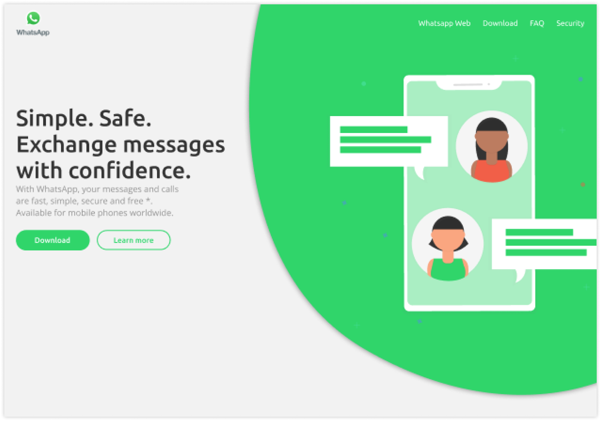

<p align="center">
  
</p>

<h1 align="center" style="border-bottom:none">Whatsapp Landing Page</h1>
<p align="center">
    Redesign do website do whatsapp
</p>

<p align="center">  
  
  
</p>

<p align="center">
  
</p>

## Tabela de conteúdos
   * [Sobre](#Sobre)
   * [Pré Requisitos](#pre-requisitos)    
   * [Como usar](#como-usar)
   * [Tecnologias](#tecnologias)
   * [Como Contribuir](#contribuir)
   * [Licença](#licença)
   
<h2 id="Sobre">Sobre o Projeto</h2>
Projeto feito para práticar e aprender mais sobre UI/UX e também sobre o framework Nextjs e Typescript.

Figma: https://www.figma.com/file/OkWK4GXJtbluzddJfC3lj0/Whatsapp-Landing-Page?node-id=0%3A1

<h2 id="pre-requisitos">Pré Requisitos</h2>

Antes de começar, você vai precisar ter instalado em sua máquina as seguintes ferramentas: <br />
- [Git](https://git-scm.com)
- [Node.js](https://nodejs.org/en/). 

<br />

Além disto é bom ter um editor para trabalhar com o código como: <br />
- [VSCode](https://code.visualstudio.com/)

<h2 id="como-usar">Rodando o Front-end</h2>

```bash
# Clone este repositório
$ git clone <https://github.com/vduggen/Whatsapp-Landing-Page>

# Acesse a pasta do projeto no terminal/cmd
$ cd Whatsapp-Landing-Page

# Instale as dependências
$ npm install ou yarn install

# Execute a aplicação em modo de desenvolvimento
$ npm run dev ou yarn dev

# O servidor inciará na porta:3000 - acesse <http://localhost:3000>
```

<h2 id="tecnologias">Tecnologias</h2>

As seguintes ferramentas foram usadas na construção do projeto:

- [Nextjs](https://nextjs.org/)
- [Styled Components](https://styled-components.com/)
- [TypeScript](https://www.typescriptlang.org/)


<h2 id="contribuir">Como contribuir</h2>

1. Faça um fork desse repositório;
1. Cria uma branch com a sua feature: `git checkout -b minha-feature`;
1. Faça commit das suas alterações: `git commit -m 'feat: Minha nova feature'`;
1. Faça push para a sua branch: `git push origin minha-feature`.

Depois que o merge da sua pull request for feito, você pode deletar a sua branch.

<h2 id="licença">Licença</h2>

Esse projeto está sob a licença MIT. Veja o arquivo [LICENSE](LICENSE.md) para mais detalhes.
